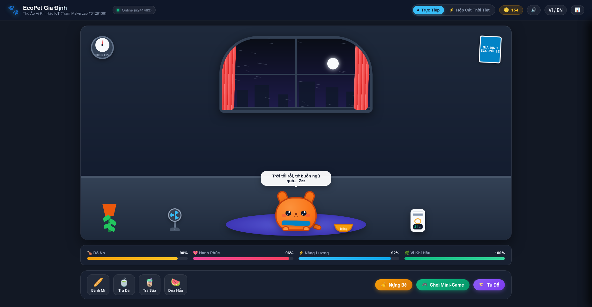

# 🐾 EcoPet Gia Định — Thú Ảo Vi Khí Hậu IoT

<div align="center">



<br/>


**Thú Ảo Tương Tác Sống Cùng Nhịp Đập Vi Khí Hậu Trạm MakerLab Gia Định (Kênh 3428136)**  
*Biến 8 dòng dữ liệu thời tiết & môi trường thành trải nghiệm nuôi thú ảo, chơi mini-game và khám phá khoa học vi khí hậu.*

</div>

---

## 🌟 Giới Thiệu (Overview)

**EcoPet Gia Định** là ứng dụng web tương tác được xây dựng hoàn toàn bằng **HTML5, CSS3 và Vanilla JavaScript thuần túy** (không dùng bất kỳ thư viện ngoài, bundler hay npm packages nào).

Ứng dụng kết nối trực tiếp với trạm quan trắc IoT **MakerLab Gia Định** (`ThingSpeak Channel 3428136`), tự động cập nhật mỗi 20 giây và mang lại một người bạn thú ảo nhỏ bé sống trong căn phòng phản ánh 1:1 thời tiết thực tế bên ngoài:

- Trời nóng? Bé đổ mồ hôi, với tay đòi uống **Trà Đá Sài Gòn** và bật quạt bàn cổ điển!
- Gió thổi mạnh? Rèm cửa, cây trầu bà và khăn quàng cổ bay phần phật theo đúng hướng và vận tốc gió!
- Bụi mịn PM2.5 tăng cao? Bé tự giác đeo khẩu trang bảo vệ và máy lọc không khí bật vòng đèn cảnh báo!
- Đường phố ồn ào? Bé đeo tai nghe neon DJ và lắc lư theo nhịp!
- Ban đêm trời tối? Căn phòng bật đèn bàn ấm áp và bé mắt lim dim buồn ngủ!

---

## 🎮 Các Tính Năng Tương Tác Nổi Bật

### 1. 🐱 Tương Tác Vật Lý Với EcoPet (Petting & Tickling)
- **Nựng Bé (Pet)**: Nhấp hoặc xoa vào EcoPet kích hoạt hiệu ứng vật lý *Squash & Stretch* nảy tưng tưng, phát tiếng kêu gừ gừ (*Purr*) âu yếm và tỏa tim hồng.
- **Cù Léc (Tickle)**: Nhấp đôi nhanh khiến bé bật nhảy santo trên không kèm tiếng cười lí lắc và thưởng EcoCoins.

### 2. 🥖 Quầy Ẩm Thực Đường Phố Sài Gòn (Feeding Station)
- **Bánh Mì**: Giòn rụm, tăng mạnh độ no (+30%) và hồi phục năng lượng kèm hiệu ứng âm thanh cắn giòn (*Crunch*).
- **Trà Đá Sài Gòn**: Món giải nhiệt quốc dân! Khi nhiệt độ ngoài trời $> 30^\circ\text{C}$, cho bé uống trà đá sẽ lập tức làm dịu cơn nóng.
- **Trà Sữa Trân Châu**: Mang lại cảm giác ngọt ngào, đẩy chỉ số Hạnh Phúc (+30%).
- **Dưa Hấu**: Trái cây tươi mát giải khát và bù nước cho những ngày oi bức.

### 3. 🕹️ Mini-Game "Bắt Gió Sạch" (Clean Breeze Catcher)
- Tích hợp sẵn một mini-game arcade viết bằng **HTML5 Canvas** (60 FPS).
- Người chơi điều khiển bé hứng những **Làn Gió Xanh 🍃**, **Tia Nắng ☀️** và né tránh **Bụi Mịn PM2.5 🌫️**.
- Tốc độ rơi và độ nghiêng của vật phẩm phụ thuộc trực tiếp vào vận tốc gió trạm thời gian thực!
- Điểm thưởng được quy đổi thành **EcoCoins** để mua sắm.

### 4. 👒 Tủ Đồ Phụ Kiện (Wardrobe Shop)
Dùng EcoCoins để mua và trang bị phụ kiện thời trang độc đáo:
- 🎋 **Nón Lá**: Nét đẹp truyền thống Việt Nam che nắng che mưa.
- 🕶️ **Cyber Pixel Shades**: Kính râm cực ngầu.
- 👑 **Vương Miện Vàng (Golden Crown)**
- 🎧 **Tai Nghe Neon Gamer**
- 🎀 **Nơ Đỏ Dễ Thương**
- 👨‍🍳 **Mũ Đầu Bếp Toque**

### 5. ⚡ Hộp Cát Thời Tiết (Weather God Mode)
- Chuyển đổi giữa chế độ **Trực Tiếp (Live IoT)** và **Hộp Cát (God Mode)**.
- Người dùng có thể kéo thả 8 thanh trượt để thử nghiệm các hiện tượng thời tiết cực đoan:
  - Tăng gió lên 25 m/s: Gió lốc thổi đồ đạc bay nghiêng ngả!
  - Tăng nhiệt độ lên 45°C: Xem bé nóng chảy mồ hôi ròng ròng!
  - Tăng bụi PM2.5 lên 200 µg/m³: Kích hoạt chế độ lọc bụi turbo!
- Tích hợp 4 kịch bản tạo nhanh: *Nắng Gắt Sài Gòn*, *Bão Giật Mạnh*, *Sương Mù Ô Nhiễm*, *Đêm Khuya Yên Bình*.

### 6. 🔊 Âm Thanh Tổng Hợp Web Audio (Procedural Soundboard)
- Toàn bộ âm thanh (tiếng gừ gừ, nhảy lon ton, nhai thức ăn giòn rụm, tiếng ting nhận xu, tiếng gió thổi, nhạc Lo-Fi) được **tổng hợp trực tiếp bằng Web Audio API oscillators**.
- **Không cần tải bất kỳ file mp3/wav ngoài nào**, đảm bảo tốc độ mở trang tức thì và không bao giờ gặp lỗi đường dẫn âm thanh.

### 7. 📊 Bảng Quan Trắc 8 Cảm Biến (Telemetry Drawer)
- Ngăn kéo trượt hiển thị chi tiết 8 thông số từ trạm MakerLab Gia Định:
  1. **WindSpeed** (m/s)
  2. **WindDirection** (độ)
  3. **Temperature** (°C)
  4. **Pressure** (kPa)
  5. **Light** (lux)
  6. **Humidity** (%RH)
  7. **Noise** (dB)
  8. **PM2.5** (µg/m³)

---

## 📁 Cấu Trúc Mã Nguồn

```
workshop_2/
├── index.html       # Cấu trúc HTML5 semantic, sân khấu phòng ngủ, khung modal, drawer
├── style.css        # Giao diện responsive, CSS animations, hiệu ứng chuyển màu ngày/đêm
├── app.js           # Xử lý API ThingSpeak, AI thú ảo, bộ âm thanh Web Audio, Canvas Game
└── README.md        # Tài liệu hướng dẫn chi tiết
```

---

## 🚀 Hướng Dẫn Chạy Ứng Dụng (Quick Start)

Do dự án sử dụng **100% Vanilla Web Technologies**, bạn có thể chạy ngay mà không cần cài đặt node_modules hay build:

### Cách 1: Mở Trực Tiếp Trình Duyệt
Nhấp đúp chuột vào file `index.html` trong thư mục `workshop_2/` để mở trên Chrome, Edge, Safari hoặc Firefox.

### Cách 2: Khởi Động Máy Chủ Cục Bộ Nhanh

**Với Python 3:**
```bash
cd /home/iimarky123/Projects/IOT_workshop/workshop_2
python3 -m http.server 8080
```
Truy cập: `http://localhost:8080`

**Với Node / npx:**
```bash
npx serve .
```

---

## 🌿 Bản Quyền & Giấy Phép
Dự án được phát triển trong khuôn khổ chuỗi bài tập thực hành IoT Web Workshop.  
Giấy phép mã nguồn mở MIT.
